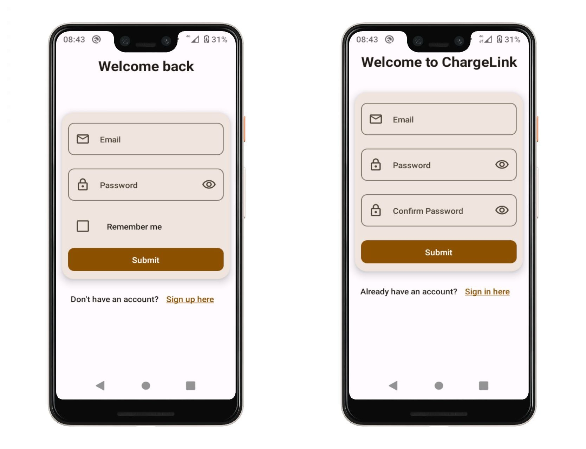
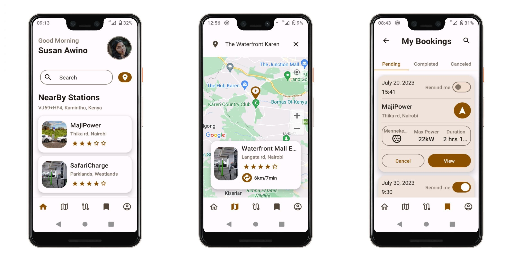
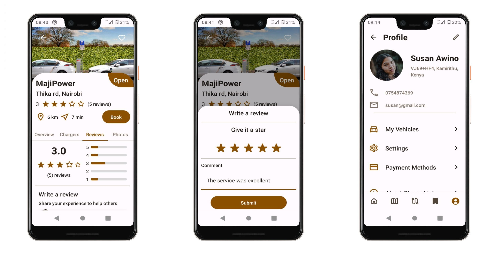
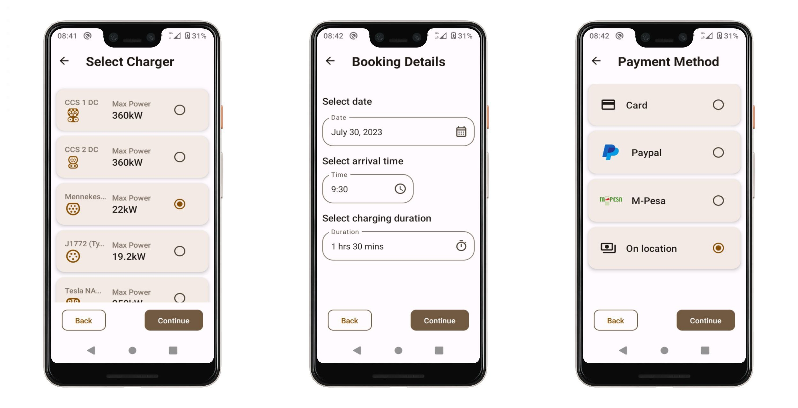
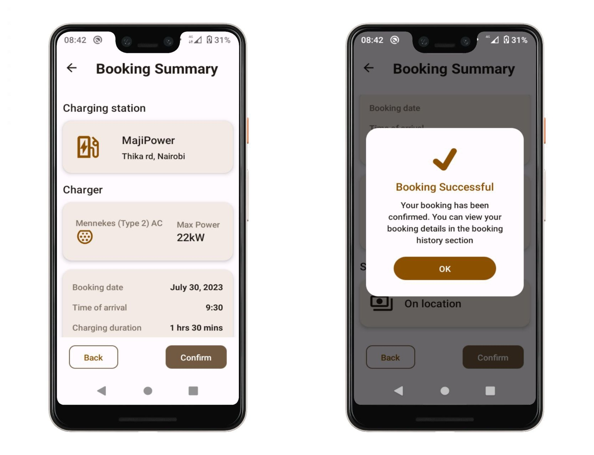
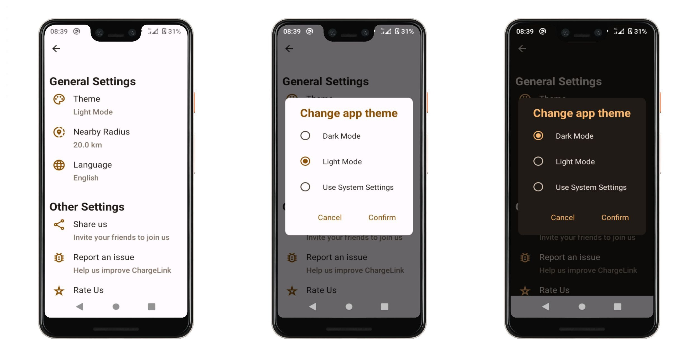

# ChargeLink
ChargeLink is a mobile app built using Jetpack Compose and Kotlin, designed to assist electric car owners in Nairobi with locating charging stations and planning trips ahead of time.

## Features
  - **User Authentication**: Securely authenticate users using Firebase Authentication, ensuring a personalized experience.
  - **Nearby Charging Stations**: Instantly find nearby charging stations to conveniently charge electric vehicles.
  - **Charger Booking**: Reserve charging stations in advance for a hassle-free charging experience.
  - **Charging Station Reviews**: Share experiences and provide valuable feedback by writing reviews for charging stations.
  - **Route Planning**: Create routes using Google Maps and view charging stations along the selected route.
  - **Place Search**: Easily search for any place using Google Places SDK and explore available charging stations in that area.
  - **Dark and Light Modes**: Choose between dark and light themes to suit your preferences and environment.

## Tech stacks and libraries
  - **Jetpack Compose**: Modern Android UI toolkit for building beautiful and reactive user interfaces.
  - **Preference DataStore**: Efficiently store user preferences, such as the app theme, using DataStore.
  - **Retrofit**: Perform direction requests via the Google Directions API for route planning.
  - **Glide**: Load and display images, including charging station photos, with ease.
  - **Firebase Storage**: Store images, while Firebase Firestore manages the charging station data.
  - **Google Maps Compose SDK**: Integrate Google Maps to visualize charging station locations and plan routes.
  - **Dagger Hilt**: Utilize Dagger for dependency injection and streamlined development.
  - **LiveData and Flows**: Observe data changes with LiveData and utilize Flows for reactive programming.
  - **Repository Pattern**: Organize data access and abstract data sources with the repository pattern.
  - **MVVM Architecture**: Architect the app using the Model-View-ViewModel (MVVM) pattern for separation of concerns.

## Screenshots

### Authentication screens

### Homepage screens

### Details screen

### Booking screens

### Settings screens

